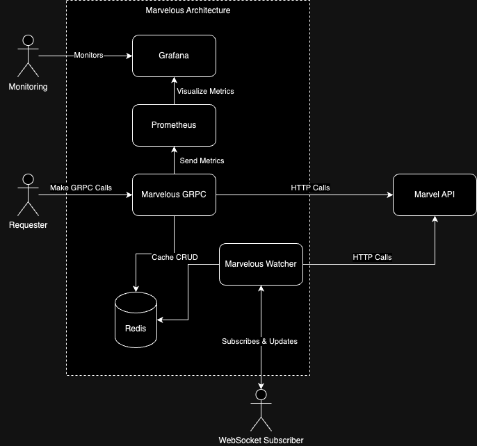

# Marvelous Project

## Table of Contents
1. [Project Description](#project-description)
2. [Installation](#installation)
3. [Architecture Diagram](#architecture-diagram)
4. [How to call the GRPC Service](#how-to-call-the-grpc-service)


## Project Description
Marvelous is a project that interacts with the Marvel API to fetch and cache Marvel character data. It includes a gRPC service and a WebSocket service to handle real-time updates.

## Installation
1. Clone the repository:
   ```sh
   git clone https://github.com/yourusername/marvelous.git
   cd marvelous
    ```
2. Copy the `application.properties.template` located in `src/main/resources/` and rename it as `application.properties`. Replace the public and private keys with your own.
    ```properties
    marvel.api.publicKey=YOUR_PUBLIC_KEY
    marvel.api.privateKey=YOUR_PRIVATE_KEY
    ```
3. Run the application using docker:
    ```sh
    docker-compose up
    ```

## Architecture Diagram


## How to call the GRPC Service
You may check out the GRPC documentation in the index.html file located in sabledocs_output folder.

## Connecting to the Watcher Websocket
You can connect to the WebSocket service using the following URL:
```
ws://localhost:8080/ws/characters
```

## Conneting to the Grafana Monitor
You can connect to the Grafana Monitor using the following URL:
```
http://localhost:3000/dashboards
```